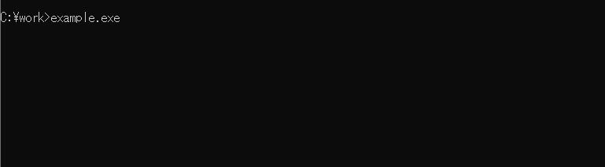

# ProgressBar.hpp

C++ Class Library to show CUI Progress Bar


# DEMO


# Features

* Header only library
* Platform independent (It would be ...). Tested on Windows and Linux.
* Legacy C++ compilers such as *Borland*, *Digital Mars* and *Open Watcom* are supported.

# Requirement

* C++ compiler (g++, Visual C++, Borland C++, Digital Mars C++ and Open Watcom C++ are tested)

# Installation

Copy the **ProgressBar.hpp** file in the same directory as the source files.

# Usage

Include the **ProgressBar.hpp** in your C++ source file and instantiate *PrograssBar* object. Please see [example.cpp](./example/example.cpp) for details.  


# Class Description

| Member | Description |
| :---   | :---        |
| **ProgressBar**(*totalcount*=1, *title*="", *fgchar*='\0', *arrowchar*='.', *bgchar*='.', *width*=-1) | A constructor.<br>***fgchar***, ***arrowchar*** and ***bgchar*** define the foreground character, the arrow character and the background character respectively. The foreground character is solid if ***fgchar***__='\0'__ (default).<br>***width*** specifys the console width. The width will be determined automatically if ***width***__=-1__ (default).<br>**ProgressBar**() calls the following methods: <br>**set_total**(*totalcount*); <br>**set_barstyle**(*fgchar*, *arrowchar*, *bgchar*); <br>**set_width**(*width*); <br>**set_title**(*title*); <br>**set_bracketstyle**(); <br>**use_percentstyle()**; |
| **start**() | Reset internal counters, disable cursor and show initial bar. |
| **update**() | Increment internal counters and update the display. Also you can use unary operator **++** instead. |
| **reset**() | Reset internal counters. |
| **set_total**(*totalcount*) | Set a total count. |
| **set_barstyle**(*fgchar*='\0', *arrowchar*='.', *bgchar*='.') | ***fgchar***, ***arrowchar*** and ***bgchar*** define the foreground character, the arrow character and the background character respectively. The foreground character is solid if ***fgchar***__='\0'__ (default). |
| **set_width**(*width*=-1) | Specify the console width. The console width is determined automatically if ***width***__=-1__ (default). |
| **set_title**(*title*) | Set the bar title. |
| **set_bracketstyle**(*lbra*='\|', *rbra*='\|') | Set bracket characters. |
| **use_percentstyle**()<br>**use_ratiostyle**() | Select percentstyle or ratio style. The percet style such as "**50\%**" is used after **use_percentstyle**() is called, and the ratio style such as "**500/1000**" is used after **use_ratiostyle**() is called. |
| **set_cursor_visible**(**true** or **false**) | Show/Hide a cursor.<br>**set_cursor_visible**(**false**) is called in **start**() and **set_cursor_visible**(**true**) is called when internal counter readches *totalcount*. |


# Note

This library is ***experimental*** and ***not guaranteed***.  

# Author

* [Kitanokitsune](https://github.com/kitanokitsune)  

# License

**ProgressBar.hpp** is under [MIT license](https://en.wikipedia.org/wiki/MIT_License).  
```text
Copyright (c) 2023 Kitanokitsune

Permission is hereby granted, free of charge, to any person obtaining a copy
of this software and associated documentation files (the "Software"), to deal
in the Software without restriction, including without limitation the rights
to use, copy, modify, merge, publish, distribute, sublicense, and/or sell
copies of the Software, and to permit persons to whom the Software is
furnished to do so, subject to the following conditions:

The above copyright notice and this permission notice shall be included in all
copies or substantial portions of the Software.

THE SOFTWARE IS PROVIDED "AS IS", WITHOUT WARRANTY OF ANY KIND, EXPRESS OR
IMPLIED, INCLUDING BUT NOT LIMITED TO THE WARRANTIES OF MERCHANTABILITY,
FITNESS FOR A PARTICULAR PURPOSE AND NONINFRINGEMENT. IN NO EVENT SHALL THE
AUTHORS OR COPYRIGHT HOLDERS BE LIABLE FOR ANY CLAIM, DAMAGES OR OTHER
LIABILITY, WHETHER IN AN ACTION OF CONTRACT, TORT OR OTHERWISE, ARISING FROM,
OUT OF OR IN CONNECTION WITH THE SOFTWARE OR THE USE OR OTHER DEALINGS IN THE
SOFTWARE.
```